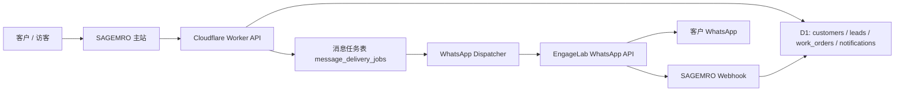

# SAGEMRO EngageLab + WhatsApp 服务号前期准备

> 日期：2026-06-19  
> 状态：前期准备文档，尚未启用真实发送。  
> 适用范围：国际站 `sagemro.com` 优先；中国站 `sagemro.cn` 只作为客户留资与跨境客户触达的备选通道，不作为国内主通知渠道。

## 1. 目标

通过 EngageLab 接入 WhatsApp Business 能力，让 SAGEMRO 在客户明确授权后，用 WhatsApp 承接国际客户的服务跟进、工单状态提醒、报价确认提醒和售后回访。

这不是替代站内工单消息，也不是工程师私聊客户的入口。WhatsApp 应定位为“官方服务触达通道”，所有关键业务记录仍应回写到 SAGEMRO 工单、线索和通知系统。

## 2. 商业定位

推荐先支持三类消息：

- 服务线索跟进：AI 初诊后，用户留下 WhatsApp，SAGEMRO 官方服务代表继续确认设备型号、报警截图、现场照片。
- 工单状态提醒：工单创建、派工、报价待确认、服务报告待确认、评价提醒。
- 售后复访：服务完成后 24-72 小时复访，收集满意度和潜在备件/新机需求。

暂不建议开放：

- 工程师绕过平台直接加客户 WhatsApp。
- 未经客户授权的营销群发。
- 把 WhatsApp 当作唯一工单沟通记录。
- 对中国大陆普通客户强推 WhatsApp。

## 3. 费用和合规提醒

使用 WhatsApp Business / EngageLab 可能产生第三方消息费用、模板审核相关费用或按会话/消息计费。真实启用前必须在 EngageLab 后台确认当前价格、计费口径和结算币种。

合规上必须注意：

- 客户必须主动提供 WhatsApp 号码或明确勾选同意接收 WhatsApp 服务通知。
- 主动模板消息必须使用已审核模板。
- 不发送未经许可的营销内容。
- 工单、报价、服务结果仍以 SAGEMRO 平台记录为准。
- WhatsApp 回调中的手机号、消息内容和状态日志属于个人信息或业务敏感信息，必须最小化保存。

## 4. 官方接入事实

根据 EngageLab WhatsApp 官方文档：

- 发送接口基地址：`https://wa.api.engagelab.cc/v1/messages`
- 鉴权方式：HTTP Basic Auth，值为 `base64(dev_key:dev_secret)`
- 发送格式：JSON
- 典型消息类型：文本消息、模板消息、媒体消息等
- 主动触达通常需要模板消息，尤其是超过 WhatsApp 客服会话窗口的场景
- EngageLab 支持配置回调 URL 接收消息状态或用户回复

> 备注：具体字段命名、模板参数格式、媒体上传规则以后端实现时的最新 EngageLab 文档为准。实现前需要再次核对官方文档，避免字段版本变化。

## 5. 建议架构

核心原则：

- 前端只收集授权和号码，不直接调用 EngageLab。
- Worker 统一做权限、模板选择、脱敏、频控和发送记录。
- 所有 WhatsApp 发送必须先写入任务表，再由发送器处理，避免业务接口被第三方延迟拖慢。
- Webhook 只更新消息状态和必要回复摘要，不把 WhatsApp 当成主数据库。

## 6. 数据模型建议

后续建议新增三张表。

### 6.1 contact_channels

用于保存客户或线索的外部触达方式。

建议字段：

- `id`
- `owner_type`：`customer` / `lead`
- `owner_id`
- `channel`：`whatsapp`
- `address`：E.164 格式手机号，例如 `+14155552671`
- `consent_status`：`granted` / `revoked`
- `consent_source`：`chat` / `profile` / `work_order` / `manual_admin`
- `market`：`com` / `cn`
- `created_at`
- `updated_at`

### 6.2 message_delivery_jobs

用于排队发送 WhatsApp / Email / SMS 等外部消息。

建议字段：

- `id`
- `channel`：`whatsapp`
- `provider`：`engagelab`
- `recipient`
- `template_key`
- `locale`
- `payload_json`
- `status`：`pending` / `sent` / `failed` / `delivered` / `read`
- `provider_message_id`
- `error_code`
- `error_message`
- `related_type`：`lead` / `work_order` / `quote` / `service_report`
- `related_id`
- `created_at`
- `sent_at`
- `updated_at`

### 6.3 message_provider_events

用于保存 EngageLab webhook 状态事件。

建议字段：

- `id`
- `provider`：`engagelab`
- `event_type`
- `provider_message_id`
- `job_id`
- `raw_event_json`
- `received_at`

## 7. Secret 和环境变量

真实启用前在 Cloudflare Worker production 环境配置：

- `ENGAGELAB_WHATSAPP_DEV_KEY`
- `ENGAGELAB_WHATSAPP_DEV_SECRET`
- `ENGAGELAB_WHATSAPP_API_BASE`，默认 `https://wa.api.engagelab.cc`
- `ENGAGELAB_WHATSAPP_WEBHOOK_SECRET`，SAGEMRO 自己生成，用于保护回调路径或签名校验
- `WHATSAPP_OUTBOUND_ENABLED`，生产开关，初始设为 `false`

所有密钥只能通过 `wrangler secret put --env production` 或 GitHub Secrets 注入，不能写入代码、文档或前端。

## 8. 推荐模板

第一批只申请服务类模板，不申请营销模板。

### 8.1 服务线索跟进

英文建议：

`Hello {{1}}, this is SAGEMRO official service. We received your laser equipment request: {{2}}. Please reply with the machine brand, model, and alarm photo so we can prepare the next step.`

中文建议：

`您好 {{1}}，这里是 SAGEMRO 官方服务。我们已收到您的设备问题：{{2}}。请回复设备品牌、型号和报警页面照片，我们将继续确认下一步。`

### 8.2 报价待确认

英文建议：

`SAGEMRO service quote {{1}} is ready for your review. Please sign in to confirm the service scope, price, and schedule.`

中文建议：

`SAGEMRO 服务报价 {{1}} 已生成，请登录平台确认服务范围、价格和时间安排。`

### 8.3 服务报告待确认

英文建议：

`Your SAGEMRO service report for {{1}} is ready. Please review the result and confirm whether the machine is operating normally.`

中文建议：

`您的 SAGEMRO 服务报告 {{1}} 已生成，请查看服务结果并确认设备是否恢复正常。`

## 9. 与现有系统的关系

现有系统已有：

- `notifications`：站内通知。
- `work_order_messages`：工单客户/工程师/系统消息，已支持附件、内部备注和客户可见标记。
- `leads`：AI 和表单线索。
- `customers` / `engineers`：用户身份。

WhatsApp 不应替换这些表。推荐做法：

- 每次外部发送前，先生成站内通知或工单系统消息。
- WhatsApp 只发送摘要和跳转提醒。
- 客户在 WhatsApp 回复后，只把必要摘要回写到工单消息，并标记来源为 `whatsapp`.
- 内部派工、报价审核、风控判断不得通过 WhatsApp 直接暴露给客户或工程师。

## 10. 第一阶段开发范围

建议第一阶段只做“可开关的基础设施”，不直接大规模发送。

包含：

- 新增数据表 migration。
- 新增 `worker/src/lib/engagelab-whatsapp.js`，封装鉴权、发送、错误归一。
- 新增发送任务创建函数，不在业务接口里直接发送。
- 新增 webhook endpoint：`POST /api/webhooks/engagelab/whatsapp/:secret`
- 新增 admin 测试接口，仅 production 关闭、development 可用。
- 给客户资料或线索资料预留 WhatsApp 字段和授权状态。
- 增加测试覆盖鉴权头、禁用开关、空配置失败、webhook 安全路径。

不包含：

- 真实营销群发。
- 前端大 UI。
- 工程师直接绑定 WhatsApp。
- 自动把 WhatsApp 回复转给工程师私聊。

## 11. 推荐上线顺序

1. 在 EngageLab 后台确认 WhatsApp Business 开通、号码、价格、模板审核流程。
2. 准备第一批 3 个服务模板并提交审核。
3. 在 staging/development 环境实现发送封装和 webhook 记录。
4. 用测试号码做端到端验证。
5. production 先开启 `WHATSAPP_OUTBOUND_ENABLED=false` 部署。
6. 只对白名单客户打开发送。
7. 观察送达率、失败率、客户回复质量。
8. 再决定是否把 AI 线索跟进、报价提醒、报告确认接入自动发送。

## 12. 风险与控制

- 成本风险：加每日/每客户发送上限，异常失败不无限重试。
- 合规风险：必须有授权记录，客户可撤回授权。
- 品牌风险：文案必须体现 SAGEMRO 官方服务，不像机器人骚扰。
- 数据风险：webhook 原始内容保存期限要有限制，避免长期堆积个人信息。
- 业务风险：工程师不能绕过平台直接联系客户，所有关键报价和确认必须在平台内完成。

## 13. Codex 下一步建议

如果继续执行，建议按以下任务拆分：

1. 先写 implementation plan，不直接写代码。
2. 新增 migration 和 provider 封装测试。
3. 新增 webhook 安全校验和事件表。
4. 接入一个低风险触发点：AI 线索人工审核后由 Admin 手动发送 WhatsApp 跟进。
5. 再评估是否把报价待确认、服务报告待确认自动化。

