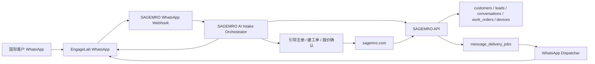

# SAGEMRO EngageLab + WhatsApp 服务号前期准备

> 日期：2026-06-19
> 状态：前期准备文档，尚未启用真实发送。
> 适用范围：国际站 `sagemro.com` 优先；中国站 `sagemro.cn` 只作为客户留资与跨境客户触达的备选通道，不作为国内主通知渠道。

## 1. 目标

通过 EngageLab 接入 WhatsApp Business 能力，把 WhatsApp 设计为 SAGEMRO 国际站的一个重要第一入口，而不是单纯的通知工具。

目标体验是：

- 用户在 WhatsApp 里直接向 SAGEMRO AI 描述设备问题、备件需求、保养需求或新机项目。
- AI 在 WhatsApp 对话中完成初步问诊、缺失信息追问、风险提示和结构化摘要。
- 当需要注册、上传更多资料、形成正式工单、确认报价或查看服务报告时，AI 引导用户进入 `sagemro.com` 完成关键动作。
- 工单、客户、设备、报价、服务报告、评价和线索等核心数据仍保存在 SAGEMRO 平台数据库，不以 WhatsApp 作为主数据库。
- 后续服务跟进、报价提醒、复访和营销触达可通过 WhatsApp 承接，但必须基于客户授权、模板审核和退订机制。

这不是工程师私聊客户的入口。WhatsApp 应是 SAGEMRO 官方 AI 和官方服务代表的统一入口，所有关键业务记录必须回写到 SAGEMRO 工单、线索、通知和客户档案系统。

## 2. 商业定位

推荐把 WhatsApp 分成四类能力。

### 2.1 第一入口：WhatsApp AI Intake

用户可以直接在 WhatsApp 发：

- “My laser cutter has an alarm”
- “Need protective lens for Raytools head”
- “How to cut 6mm stainless steel?”
- “I want to buy a new fiber laser cutting machine”

SAGEMRO AI 需要完成：

- 识别需求属于故障诊断、切割参数、备件识别、维修预估、新机选型或设备健康报告。
- 自动追问关键缺失信息，例如设备品牌、型号、功率、所在地、报警照片、停机状态。
- 生成初步安全建议，但不做最终诊断、不承诺报价、不指挥高风险维修。
- 给出明确下一步：继续补充信息、去 `sagemro.com` 注册、形成工单、请求官方服务或转 Euchio 新机项目。

### 2.2 服务跟进：Service Follow-up

适合自动或半自动发送：

- AI 初诊后提醒客户补充图片、铭牌、报警页。
- 工单创建成功通知。
- 报价待确认提醒。
- 服务报告待确认提醒。
- 服务完成后 24-72 小时复访。

### 2.3 市场营销：Lifecycle Marketing

可行，但必须谨慎。建议只做“工业设备生命周期营销”，不要做泛促销群发：

- 备件耗材补货提醒。
- 保养周期提醒。
- 设备健康检查邀请。
- 停机风险预防清单。
- 新机升级或自动化改造建议。
- Euchio 新机项目跟进。

营销触达必须有明确授权、退订入口、频控和内容分层。优先从“服务价值型内容”开始，而不是直接发广告。

### 2.4 人工接管：Official Service Handoff

当 AI 识别到高风险、强交易意向、报价、现场服务或投诉时，应进入 SAGEMRO 官方服务代表接管流程。工程师不应绕过平台直接与客户私聊。

暂不建议开放：

- 工程师绕过平台直接加客户 WhatsApp。
- 未经客户授权的营销群发。
- 把 WhatsApp 当作唯一工单沟通记录。
- 对中国大陆普通客户强推 WhatsApp。

## 3. 费用和合规提醒

使用 WhatsApp Business / EngageLab 可能产生第三方消息费用、模板审核相关费用或按会话/消息计费。真实启用前必须在 EngageLab 后台确认当前价格、计费口径和结算币种。

合规上必须注意：

- 客户必须主动提供 WhatsApp 号码或明确勾选同意接收 WhatsApp 服务通知。
- 主动模板消息必须使用已审核模板。
- 不发送未经许可的营销内容。
- 营销、服务、报价、复访、活动邀请等不同类别建议分别授权，至少在授权文案中讲清楚客户会收到哪些类型的信息。
- 必须提供清晰退订方式，例如用户回复 `STOP` / `UNSUBSCRIBE` 后停止营销消息。
- AI 自动回复必须提供人工转接路径，例如进入 `sagemro.com` 工单、官方邮箱、电话或人工服务代表。
- 工单、报价、服务结果仍以 SAGEMRO 平台记录为准。
- WhatsApp 回调中的手机号、消息内容和状态日志属于个人信息或业务敏感信息，必须最小化保存。

## 4. 官方接入事实

根据 EngageLab WhatsApp 官方文档：

- 发送接口基地址：`https://wa.api.engagelab.cc/v1/messages`
- 鉴权方式：HTTP Basic Auth，值为 `base64(dev_key:dev_secret)`
- 发送格式：JSON
- 典型消息类型：文本消息、模板消息、媒体消息等
- 主动触达通常需要模板消息，尤其是超过 WhatsApp 客服会话窗口的场景
- EngageLab 支持配置回调 URL 接收消息状态或用户回复

> 备注：具体字段命名、模板参数格式、媒体上传规则以后端实现时的最新 EngageLab 文档为准。实现前需要再次核对官方文档，避免字段版本变化。

根据 WhatsApp Business 官方公开说明：

- WhatsApp Business Platform 支持线索生成、营销、销售、客户支持、通知和自动化对话等场景。
- WhatsApp 官方把消息分成 marketing、utility、authentication、service 等类别，价格和规则会按类别、市场和交付情况变化。
- 用户主动发起消息后，会打开 24 小时客户服务窗口；窗口外主动触达通常需要使用已审核模板。
- 商家只能在用户提供手机号并授权后联系用户，也必须尊重用户退订。

参考链接：

- WhatsApp Business Platform: https://whatsappbusiness.com/products/business-platform/
- WhatsApp Business Platform Pricing: https://whatsappbusiness.com/products/platform-pricing/
- WhatsApp Business Messaging Policy: https://whatsappbusiness.com/policy/

## 5. 建议架构

核心原则：

- WhatsApp 入站消息先进 webhook，再进入 SAGEMRO AI intake，而不是直接分配给工程师。
- AI 只做初步沟通、结构化、风险提示和转化引导；正式工单、报价、报告和客户确认必须回到 `sagemro.com`。
- 前端只收集授权和号码，不直接调用 EngageLab。
- Worker 统一做权限、模板选择、脱敏、频控和发送记录。
- 所有 WhatsApp 主动发送必须先写入任务表，再由发送器处理，避免业务接口被第三方延迟拖慢。
- Webhook 可以保存必要消息摘要和附件引用，但不把 WhatsApp 当成主数据库。
- 工程师端只看到平台工单消息，不直接拿到客户 WhatsApp 私聊权限。

## 6. 数据模型建议

后续建议新增六类数据结构。第一阶段可以先建前四类，营销自动化成熟后再扩展分群和活动表。

### 6.1 contact_channels

用于保存客户或线索的外部触达方式。

建议字段：

- `id`
- `owner_type`：`customer` / `lead`
- `owner_id`
- `channel`：`whatsapp`
- `address`：E.164 格式手机号，例如 `+14155552671`
- `consent_status`：`unknown` / `granted` / `revoked`
- `consent_scope`：`service` / `marketing` / `both`
- `consent_source`：`whatsapp_inbound` / `chat` / `profile` / `work_order` / `manual_admin`
- `last_inbound_at`
- `last_outbound_at`
- `market`：`com` / `cn`
- `created_at`
- `updated_at`

### 6.2 external_conversations

用于把 WhatsApp 会话和 SAGEMRO 会话、线索、客户、工单关联起来。

建议字段：

- `id`
- `channel`：`whatsapp`
- `provider`：`engagelab`
- `external_user_id` 或 `external_phone`
- `conversation_id`：关联 SAGEMRO conversations，可为空
- `lead_id`：可为空
- `customer_id`：注册后回填
- `work_order_id`：形成工单后回填
- `intent_type`：`diagnosis` / `cutting_parameters` / `parts` / `repair_estimate` / `machine_selection` / `health_report` / `general`
- `stage`：`ai_intake` / `awaiting_registration` / `work_order_created` / `official_follow_up` / `closed`
- `locale`
- `last_summary_json`
- `created_at`
- `updated_at`

### 6.3 inbound_channel_messages

用于保存 WhatsApp 入站消息的必要记录和 AI 处理状态。

建议字段：

- `id`
- `external_conversation_id`
- `provider_message_id`
- `from_address`
- `message_type`：`text` / `image` / `video` / `document` / `audio` / `location`
- `content_text`
- `media_url`
- `redacted_content_text`
- `ai_processing_status`：`pending` / `processed` / `failed` / `ignored`
- `created_at`

### 6.4 message_delivery_jobs

用于排队发送 WhatsApp / Email / SMS 等外部消息。

建议字段：

- `id`
- `channel`：`whatsapp`
- `provider`：`engagelab`
- `recipient`
- `template_key`
- `message_category`：`service` / `utility` / `marketing`
- `locale`
- `payload_json`
- `status`：`pending` / `sent` / `failed` / `delivered` / `read`
- `provider_message_id`
- `error_code`
- `error_message`
- `related_type`：`lead` / `work_order` / `quote` / `service_report`
- `related_id`
- `created_at`
- `sent_at`
- `updated_at`

### 6.5 message_provider_events

用于保存 EngageLab webhook 状态事件。

建议字段：

- `id`
- `provider`：`engagelab`
- `event_type`
- `provider_message_id`
- `job_id`
- `raw_event_json`
- `received_at`

### 6.6 channel_consent_events

用于保存授权、撤回、退订、重新订阅的审计记录。

建议字段：

- `id`
- `contact_channel_id`
- `event_type`：`granted` / `revoked` / `unsubscribed` / `resubscribed`
- `scope`：`service` / `marketing` / `both`
- `source`：`whatsapp_keyword` / `website_checkbox` / `admin_manual` / `import`
- `raw_text`
- `created_at`

## 7. Secret 和环境变量

真实启用前在 Cloudflare Worker production 环境配置：

- `ENGAGELAB_WHATSAPP_DEV_KEY`
- `ENGAGELAB_WHATSAPP_DEV_SECRET`
- `ENGAGELAB_WHATSAPP_API_BASE`，默认 `https://wa.api.engagelab.cc`
- `ENGAGELAB_WHATSAPP_WEBHOOK_SECRET`，SAGEMRO 自己生成，用于保护回调路径或签名校验
- `WHATSAPP_OUTBOUND_ENABLED`，生产开关，初始设为 `false`

所有密钥只能通过 `wrangler secret put --env production` 或 GitHub Secrets 注入，不能写入代码、文档或前端。

## 8. 推荐模板

第一批只申请服务类模板，不申请营销模板。

另需准备 WhatsApp AI 第一入口自动回复文案。用户主动发起的 24 小时服务窗口内，可优先使用普通文本回复；窗口外主动触达再使用模板。

### 8.0 WhatsApp AI 欢迎语

英文建议：

`Welcome to SAGEMRO official AI service. Tell us your machine issue, spare parts need, cutting problem, maintenance question, or new-machine project. We will help organize the case and guide you to the right next step. For official diagnosis, quote, and safety confirmation, please complete the service request on sagemro.com.`

中文建议：

`欢迎使用 SAGEMRO 官方 AI 服务。你可以直接描述设备故障、备件需求、切割问题、保养问题或新机项目。我们会帮你整理信息并引导下一步。正式诊断、报价和现场安全确认请在 sagemro.com 完成服务申请。`

### 8.1 服务线索跟进

英文建议：

`Hello {{1}}, this is SAGEMRO official service. We received your laser equipment request: {{2}}. Please reply with the machine brand, model, and alarm photo so we can prepare the next step.`

中文建议：

`您好 {{1}}，这里是 SAGEMRO 官方服务。我们已收到您的设备问题：{{2}}。请回复设备品牌、型号和报警页面照片，我们将继续确认下一步。`

### 8.2 报价待确认

英文建议：

`SAGEMRO service quote {{1}} is ready for your review. Please sign in to confirm the service scope, price, and schedule.`

中文建议：

`SAGEMRO 服务报价 {{1}} 已生成，请登录平台确认服务范围、价格和时间安排。`

### 8.3 服务报告待确认

英文建议：

`Your SAGEMRO service report for {{1}} is ready. Please review the result and confirm whether the machine is operating normally.`

中文建议：

`您的 SAGEMRO 服务报告 {{1}} 已生成，请查看服务结果并确认设备是否恢复正常。`

### 8.4 授权营销内容示例

营销模板必须等服务类流程稳定后再申请。推荐先做价值型内容，而不是直接促销。

英文建议：

`Hi {{1}}, based on your SAGEMRO service record, your machine may benefit from {{2}}. Reply STOP to unsubscribe from maintenance and equipment lifecycle updates.`

中文建议：

`您好 {{1}}，根据您的 SAGEMRO 服务记录，您的设备可能适合 {{2}}。如不希望继续接收保养和设备生命周期提醒，请回复 STOP。`

## 9. 与现有系统的关系

现有系统已有：

- `notifications`：站内通知。
- `work_order_messages`：工单客户/工程师/系统消息，已支持附件、内部备注和客户可见标记。
- `leads`：AI 和表单线索。
- `customers` / `engineers`：用户身份。

WhatsApp 不应替换这些表。推荐做法：

- WhatsApp 入站对话先生成或更新 `external_conversations`，再按需要创建 `conversation`、`lead` 或 `work_order`。
- 每次外部发送前，先生成站内通知或工单系统消息。
- WhatsApp 主动消息只发送摘要和跳转提醒，关键确认必须回到平台。
- 客户在 WhatsApp 回复后，只把必要摘要回写到工单消息，并标记来源为 `whatsapp`。
- 如果客户未注册，先保留为 lead；注册后再把 lead、external conversation、customer 绑定。
- 内部派工、报价审核、风控判断不得通过 WhatsApp 直接暴露给客户或工程师。

## 10. 第一阶段开发范围

建议第一阶段只做“可开关的 WhatsApp AI Intake 基础设施”，不直接大规模营销。

包含：

- 新增数据表 migration。
- 新增 `worker/src/lib/engagelab-whatsapp.js`，封装鉴权、发送、错误归一。
- 新增 webhook endpoint：`POST /api/webhooks/engagelab/whatsapp/:secret`
- 新增 WhatsApp 入站消息解析、去重、脱敏和外部会话映射。
- 新增 WhatsApp AI intake 编排：复用现有 SAGEMRO AI prompt 原则，但输出适合 WhatsApp 的短消息。
- 新增 CTA 生成：注册链接、工单创建链接、报价确认链接、服务报告链接。
- 新增发送任务创建函数，不在业务接口里直接发送。
- 新增 admin 测试接口，仅 production 关闭、development 可用。
- 给客户资料或线索资料预留 WhatsApp 字段和授权状态。
- 增加测试覆盖鉴权头、禁用开关、空配置失败、webhook 安全路径、入站去重、STOP 退订、中文/英文回复路由。

不包含：

- 真实营销群发和自动化活动。
- 前端大 UI。
- 工程师直接绑定 WhatsApp。
- 自动把 WhatsApp 回复转给工程师私聊。

## 11. 推荐上线顺序

1. 在 EngageLab 后台确认 WhatsApp Business 开通、号码、价格、模板审核流程。
2. 准备第一批 3 个服务模板并提交审核。
3. 在 staging/development 环境实现发送封装和 webhook 记录。
4. 用测试号码做端到端验证。
5. production 先开启 `WHATSAPP_OUTBOUND_ENABLED=false` 部署。
6. 只对白名单客户打开发送。
7. 观察送达率、失败率、客户回复质量。
8. 再决定是否把 AI 线索跟进、报价提醒、报告确认接入自动发送。

## 12. 风险与控制

- 成本风险：加每日/每客户发送上限，异常失败不无限重试。
- 合规风险：必须有授权记录，客户可撤回授权。
- 品牌风险：文案必须体现 SAGEMRO 官方服务，不像机器人骚扰。
- 数据风险：webhook 原始内容保存期限要有限制，避免长期堆积个人信息。
- 业务风险：工程师不能绕过平台直接联系客户，所有关键报价和确认必须在平台内完成。
- AI 风险：WhatsApp 回复要短、稳、可执行，避免长篇技术推理；高风险维修必须转官方服务。
- 营销风险：只做和客户设备、服务记录、备件周期、新机项目相关的内容，不做无差别促销。

## 13. WhatsApp 营销运营原则

可行，但建议采用“服务型营销”而不是“广告型营销”。

推荐节奏：

- 新线索 0-24 小时：补充信息、引导注册、形成工单。
- 工单处理中：状态提醒、报价确认、服务报告确认。
- 服务完成 1-3 天：复访满意度、确认设备是否恢复稳定。
- 服务完成 30-90 天：备件耗材、保养提醒、设备健康检查。
- 多次维修或高龄设备：升级改造或 Euchio 新机项目建议。

内容原则：

- 每条消息都要让客户感觉“这和我的设备有关”。
- 不用夸张营销词，不制造焦虑。
- 每次营销都提供明确退订方式。
- 高频客户按设备和历史服务分层，不同客户发不同内容。
- 所有营销线索必须进入 SAGEMRO CRM，不在 WhatsApp 里孤立成交。

## 14. Codex 下一步建议

如果继续执行，建议按以下任务拆分：

1. 先写 implementation plan，不直接写代码。
2. 新增 migration、provider 封装测试、webhook 安全校验。
3. 先实现 WhatsApp 入站 AI Intake：用户发消息 -> webhook -> SAGEMRO AI -> WhatsApp 回复 -> 生成 lead/external conversation。
4. 再接入低风险主动触发点：AI 线索人工审核后由 Admin 手动发送 WhatsApp 跟进。
5. 然后自动化报价待确认、服务报告待确认。
6. 最后才做授权营销、客户分层和生命周期自动化。
